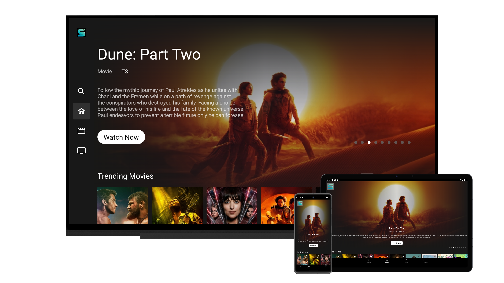

<h1 align="center">BetterStreamflix</h1>

<p align="center">
  
</p>

<p align="center">
  <strong>A modern, actively maintained Streamflix fork for Android TV and Android mobile.</strong><br />
  Fast fixes. Frequent improvements. Open source. No ads in the app interface.
</p>

<p align="center">
  <a href="https://github.com/dskja/BetterStreamflix/releases/latest"><strong>Download latest release</strong></a>
  ·
  <a href="#features">Features</a>
  ·
  <a href="https://github.com/dskja/BetterStreamflix/issues">Report a bug</a>
  ·
  <a href="https://github.com/dskja/BetterStreamflix/issues">Request a feature</a>
  ·
  <a href="./ROADMAP.md">Roadmap</a>
</p>

<p align="center">
  
  
  
  
  
</p>

---

## Why BetterStreamflix?

BetterStreamflix exists for one simple reason: **keep the Streamflix experience moving forward**.

It is an actively maintained fork focused on reliability, Android TV usability, mobile support, provider resilience, cleaner architecture and faster fixes. The project preserves credit to the original creator while continuing development in the open.

### What you get

- **Active maintenance** — fixes and improvements are shipped continuously
- **Android TV + mobile** — one project for couch and handheld use
- **Ad-free interface** — no advertising layer added by BetterStreamflix
- **Multiple providers** — browse content exposed by supported third-party sources
- **Continue Watching** — playback position and watch-state persistence
- **Smarter caching** — home caching, refresh logic and stale-cache fallback
- **In-app updates** — update flow with download progress
- **Open development** — public roadmap, changelog, issues and source code

> BetterStreamflix does not host, store or distribute copyrighted media. It is an interface/aggregator for third-party sources and is intended for educational and personal use. Users are responsible for complying with applicable laws and source terms.

## Preview

<p align="center">
  
</p>

## Features

| Area | Highlights |
| --- | --- |
| Experience | Optimized TV/mobile UI, resume playback, Continue Watching |
| Reliability | Provider fallbacks, cache recovery, clearer error handling work |
| Updates | In-app updater, release automation, changelog-driven releases |
| Performance | Memory/disk caching, request handling, image caching work |
| Architecture | Kotlin, MVVM, coroutines, Room, Retrofit/OkHttp, modular helpers |
| Quality | CI, PR checks, nightly builds, testing/QA infrastructure |

### In active development

The current development branch also contains ongoing work around:

- download queue and resume infrastructure
- cast/external-display support
- Android widgets and quick actions
- stronger network retry/error handling
- database migrations and sync coordination
- automated release/deployment tooling
- broader testing and QA utilities

See the full [CHANGELOG](./CHANGELOG.md) and [ROADMAP](./ROADMAP.md) for implementation details and upcoming work.

## Quick start

### Download the app

Go to **[Releases](https://github.com/dskja/BetterStreamflix/releases/latest)** and install the APK that matches your device/build.

> Android may ask you to allow installation from your browser or file manager because BetterStreamflix is distributed outside Google Play.

### Build from source

Requirements:

- Android Studio
- JDK 17
- Android SDK configured locally

```bash
git clone https://github.com/dskja/BetterStreamflix.git
cd BetterStreamflix
```

Open the project in Android Studio, create your local configuration from `local.properties.example`, select the desired device/layout and run the app.

## Built with

- Kotlin
- Android Studio
- Android Architecture Components
- MVVM
- Coroutines / Flow
- Retrofit / OkHttp
- Room
- Media3 / ExoPlayer
- Leanback
- Supabase integration

## Contributing

BetterStreamflix is built in public. Contributions that improve stability, UX, provider resilience, accessibility, testing or documentation are welcome.

1. Fork the repository
2. Create a feature branch
3. Make and test your change
4. Commit with a clear message
5. Open a pull request explaining what changed and why

Good first contribution? Pick an open issue, reproduce it, and include device/Android-version details in your report.

## Support the project

The easiest ways to help are simple:

- ⭐ **Star the repository** so more Android/open-source users discover it
- 🐛 **Report reproducible bugs** with useful details
- 💡 **Suggest focused features** that improve the app
- 🔧 **Submit pull requests** for fixes and improvements
- 📣 **Share BetterStreamflix** with people interested in open-source Android TV projects

## Project status

BetterStreamflix is under active development. The codebase changes frequently and some experimental infrastructure may not yet be exposed as a finished end-user feature.

Current source version: **1.9.0**.

## Legal disclaimer

**BetterStreamflix is provided for educational and personal use.**

- The project does not host, store or distribute copyrighted content
- Content availability depends on independent third-party providers
- BetterStreamflix does not control those providers or their content
- Users are responsible for ensuring they are authorized to access content
- Users must comply with applicable laws and third-party terms in their jurisdiction
- The project does not endorse copyright infringement
- Official streaming services should be used when available and appropriate

## Credits

- **[Lory-Stan TANASI](https://github.com/stantanasi)** — original Streamflix creator
- **[dskja](https://github.com/dskja)** — BetterStreamflix maintainer
- **BetterStreamflix contributors** — fixes, testing, ideas and improvements

## License

Licensed under the **Apache License 2.0**. See [LICENSE](./LICENSE).

---

<p align="center">
  <strong>If BetterStreamflix is useful to you, star the repository.</strong><br />
  Stars help independent open-source projects get discovered.
</p>
